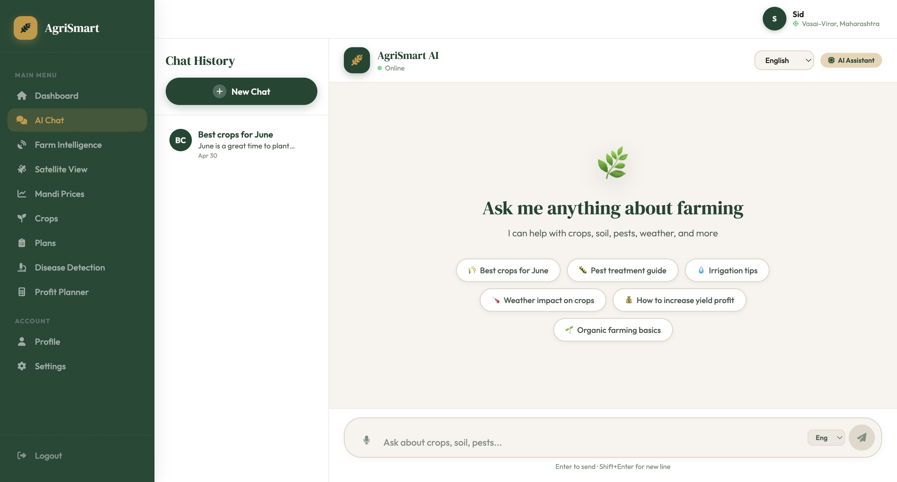

<div align="center">


# 🌾 AgriSmart

### *Grow Smarter. Farm Better.*

**An AI-powered smart farming assistant built for every Indian farmer — in their own language.**

[](https://react.dev)
[](https://nodejs.org)
[](https://mongodb.com)
[](https://groq.com)
[](LICENSE)

[Live Demo](#) · [Report Bug](https://github.com/sid-1506/agrismart/issues) · [Request Feature](https://github.com/sid-1506/agrismart/issues)

</div>

---

## 📌 About The Project

AgriSmart solves 5 real problems Indian farmers face every day:

| Problem | AgriSmart's Solution |
|--------|----------------------|
| 🚫 Information Gap | AI agronomist available 24/7 |
| 🌐 Language Barrier | 8 Indian languages supported |
| 🦠 Disease Identification | Upload a plant photo → instant AI diagnosis |
| 💰 Market Price Confusion | Real government mandi data + AI price prediction |
| 🛰️ Crop Health Monitoring | NASA + Sentinel-2 satellite NDVI analysis |

> **"Har Indian farmer ke jeb me ek AI agronomist + mandi expert + weather scientist — usi ki language me."**

---

## 🖼️ Screenshots

<table>
  <tr>
    <td align="center"><b>🏠 Landing Page</b></td>
    <td align="center"><b>📊 Dashboard</b></td>
  </tr>
  <tr>
    <td></td>
    <td></td>
  </tr>
  <tr>
    <td align="center"><b>🤖 AI Chat</b></td>
    <td align="center"><b>🛰️ Satellite Field Analyzer</b></td>
  </tr>
  <tr>
    <td></td>
    <td></td>
  </tr>
  <tr>
    <td align="center"><b>🌾 Farm Intelligence</b></td>
    <td align="center"><b>🦠 Disease Detection</b></td>
  </tr>
  <tr>
    <td></td>
    <td></td>
  </tr>
  <tr>
    <td align="center"><b>📅 My Crop Plans</b></td>
    <td align="center"><b>🌐 8 Languages</b></td>
  </tr>
  <tr>
    <td></td>
    <td></td>
  </tr>
</table>

---

## ✨ Key Features

### 🤖 AI Chat — Powered by Groq LLaMA
Ask anything about farming in your language. Multi-turn conversation with full history saved to MongoDB. Voice input supported in all 8 languages — see [docs/SPEECH_TO_TEXT.md](docs/SPEECH_TO_TEXT.md).

### 🌾 Smart Crop Recommendations
Filter crops by season (Kharif / Rabi / Zaid), region, and category. Data-backed suggestions tailored to your location.

### 📅 AI Farming Plans
Input your crop, location, and season → get a day-by-day timeline from sowing to harvest. Track each step's progress.

### 🦠 Crop Disease Detection
Upload a photo of your plant → Groq Vision identifies the disease and gives treatment advice in your language.

### 🛰️ Satellite Field Analyzer
Draw your field boundary on a map → real Sentinel-2 NDVI data returns a crop health score (Poor / Fair / Good / Excellent).

### 💰 Mandi Price Tracker + AI Prediction
Real government mandi data from Data.gov.in (AGMARKNET) + Groq-powered 7-day price prediction.

### 🌦️ Farm Intelligence Dashboard
Live field conditions powered by NASA POWER API (30-day soil climate data) + OpenWeather, combined into one dashboard.

### 📊 Profit Planner (Yield Estimator)
Enter crop + area + investment → AI calculates expected yield, gross revenue, net profit, and ROI.

### 🌐 8 Indian Languages
English · Hindi · Marathi · Tamil · Telugu · Kannada · Bengali · Gujarati
AI responds in the user's chosen language — not mixed, not translated.

---

## 🛠️ Tech Stack

### Frontend
| Technology | Purpose |
|-----------|---------|
| React 19 | UI Framework |
| Vite | Build Tool |
| React Router DOM | Client-side routing |
| Zustand | State management |
| Axios | API calls |
| Leaflet + React-Leaflet | Interactive maps |
| i18next | Multilingual support |
| Custom CSS + Variables | 2 themes, mobile-first |

### Backend
| Technology | Purpose |
|-----------|---------|
| Node.js + Express 5 | REST API server |
| MongoDB Atlas + Mongoose | Database |
| JWT + bcryptjs | Auth & security |
| Passport.js | Google OAuth 2.0 |
| Multer / Base64 | Image handling |

### APIs Integrated
| API | Provider | Used For |
|-----|---------|---------|
| LLaMA 3.3 70B | Groq | Chat, plans, mandi, yield |
| LLaMA 4 Scout (Vision) | Groq | Disease detection |
| OpenWeather | OpenWeatherMap | Weather data |
| NASA POWER | NASA | 30-day soil climate |
| Sentinel-2 NDVI | Copernicus / ESA | Crop health index |
| AGMARKNET | Data.gov.in | Real mandi prices |
| Google OAuth | Google | Social login |

---

## 📁 Project Structure

```
agrismart/
├── client/                   # React Frontend (Vite)
│   ├── src/
│   │   ├── components/       # Layout, BottomNav, ProtectedRoute
│   │   ├── pages/            # 16 pages (Dashboard, Chat, Crops, …)
│   │   ├── stores/           # Zustand (auth, chat, settings)
│   │   ├── hooks/            # useWeather, useLocation
│   │   ├── i18n/             # 8 language JSON files
│   │   ├── utils/            # SpeechRecognizer, icons, helpers
│   │   └── api/              # Axios service layer
│   └── vite.config.js
│
├── server/                   # Node.js + Express Backend
│   ├── routes/               # auth, chat, crops, plans, disease, …
│   ├── controllers/          # Business logic per route
│   ├── models/               # User, Chat, Plan, Crop (Mongoose)
│   ├── middleware/           # JWT auth, error handler, CORS
│   ├── services/             # aiService.js (Groq integration)
│   └── index.js              # Entry point (port 5001)
│
├── docs/
│   ├── FONTAWESOME.md
│   └── SPEECH_TO_TEXT.md
│
├── .gitignore
├── package.json
└── README.md
```

---

## 🚀 Getting Started

### Prerequisites
- Node.js v18+
- MongoDB Atlas account
- API keys (see Environment Variables)

### Installation

```bash
# 1. Clone the repository
git clone https://github.com/sid-1506/agrismart.git
cd agrismart

# 2. Install root dependencies
npm install

# 3. Install client dependencies
cd client && npm install

# 4. Install server dependencies
cd ../server && npm install
```

### Environment Variables

Create `.env` files:

**`server/.env`**
```env
PORT=5001
MONGODB_URI=your_mongodb_atlas_uri
JWT_SECRET=your_jwt_secret

GROQ_API_KEY=your_groq_api_key
OPENWEATHER_API_KEY=your_openweather_api_key
DATA_GOV_API_KEY=your_data_gov_api_key
SENTINEL_CLIENT_ID=your_sentinel_client_id
SENTINEL_CLIENT_SECRET=your_sentinel_client_secret

GOOGLE_CLIENT_ID=your_google_client_id
GOOGLE_CLIENT_SECRET=your_google_client_secret
GOOGLE_CALLBACK_URL=http://localhost:5001/api/auth/google/callback
```

**`client/.env`**
```env
VITE_API_URL=http://localhost:5001
```

### Running the App

```bash
# From the root — starts both frontend and backend
npm run dev
```

- Frontend: `http://localhost:5173`
- Backend: `http://localhost:5001`

---

## 🔐 Security

- Passwords hashed with **bcryptjs** (10 salt rounds)
- **JWT tokens** for stateless authentication (7-day expiry)
- All API keys stored **server-side only** — never exposed to the frontend
- `.env` files excluded from git via `.gitignore`
- **CORS** configured to allow only the frontend origin

---

## 🌟 What Makes This Different

| Typical College Project | AgriSmart |
|------------------------|-----------|
| Fake / hardcoded JSON data | Real APIs — NASA, ESA, Govt of India |
| English only | 8 Indian languages |
| 1 AI feature | 7+ AI-powered features |
| No auth | JWT + bcrypt + Google OAuth |
| Single page | 16 pages, 2 themes, mobile responsive |
| ChatGPT only | Multi-model: Groq LLaMA 3.3 + Vision |
| No satellite | Real Sentinel-2 NDVI from space |

---

## 📄 License

Distributed under the MIT License. See `LICENSE` for more information.

---

## 👨‍💻 Author

**Mehak Pandey**

---

<div align="center">

Made with ❤️ for Indian Farmers 🌾

*"Technology should speak the farmer's language — not the other way around."*

</div>
